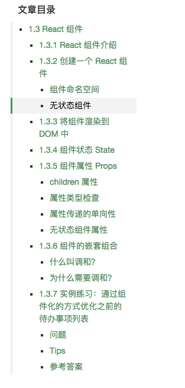
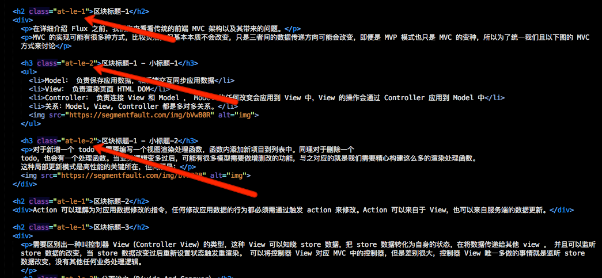

# 文章目录联动效果


实现一个类似segmentfault文章目录滚动显示组件

>
>实现如图
>

>
>要求
>
> 1. 位置在页面右边固定
> 2. 文章移动的时候目录列表跟随变化到对应的item
> 3. 点击目录列表时候文章内容跟随移动
>

## DEMO


请戳: [https://codepen.io/lancelou/full/MmbNGy/](https://codepen.io/lancelou/full/MmbNGy/)


实现较为简单，代码不多，理论上任何级标题都可以，但还是建议不要太多级，以免影响美观即效率。

## 实现

此处说一下具体的实现，如有不足，还请各位斧正！

整个功能分为两部分，一部分是文章的主体(包含有标题)，一部分就是导航链接。

#### 文章部分

文章部分对标题做了加工，如图:



* h2.at-le-1代表章标题
* h3.at-le-2代表节标题
* hx.at-le-x: 依次类推

在处理文章中的标题时，作者使用了一个函数来获取所有符合规则的标题，并按顺序存放在一个数组中。

```JavaScript
function generateNavList(navListContainer) {
	//第几个item，方便最终浮动模块去定位
	var itemsId = 1,
		scrollY = window.scrollY,
		hTitles = document.querySelectorAll('[class^="at-le-"]');
	
	//既然id是数字，直接以数组下标作为id
	//http://es6.ruanyifeng.com/#docs/iterator#for---of循环
	hTitlesObj = Array.prototype.map.call(hTitles, function (item) {
		//生成内部标题数组方便判断，数组的键即为id
		return {
			dom: item,
			top: item.getBoundingClientRect().top + scrollY
		}
	});
	navListContainer.appendChild(generateList(hTitles));
}
```

hTitlesObj即为我们根据所有的标题按照顺序组装起来的数组。并记录各个标题的top备后用。

#### 导航目录部分

这一部分的生成也是依赖于前面获得的所有的标题。

```JavaScript
function generateList(hTitles) {
	var fragment = document.createDocumentFragment(),
		curTagLev = hTitles[0].tagName[1] - 0,
		item = null,
		res = null,
		ul = null;
	for (var i = 0; i < hTitles.length; i++) {
		item = hTitles[i];
		if (curTagLev == item.tagName[1]) {
			fragment.appendChild(createALi(item.innerText));
		}else if (curTagLev > item.tagName[1]) {
			return fragment;
		}else {
			//curTagLev < item.tagName[1]
			ul = document.createElement('ul');
			res = generateList(Array.prototype.slice.call(hTitles, i));
			ul.appendChild(res);
			fragment.lastElementChild.appendChild(ul);
			i = i + ul.children.length - 1;
		}
	}
	return fragment;
}
```

这里有几个需要注意的，我们根据标题的标签的tagName来判断标签的等级，遍历整个标签数组，并记录当前标签等级，然后拿当前遍历的item的tagName来与之前记录的作对比，同级，创建li放到片段中，item级别大于记录的，返回，小于，递归。

```JavaScript
var createALi = (function () {
	var id = 0,
		li = null;
	return function (text) {
		li = document.createElement('li');
		li.innerHTML = '<a href="javascript: void(0)" data-at-id = "'+id+'">'+text+'</a>';
		id++;
		return li;
	}
})();
```

createALi创建li并负责记录当前的id，这个id是与前面的hTitlesObj的下标对应的。

#### 文章与目录联动

前文讨论的id是关键

鼠标滚动时，将当前的scrollY与之前hTitlesObj中记录的所有的header一个个从top最小的进行对比，直到找到比scrollY大的，取前一个。

```
function documentScrollHandler() {
	//加20px的缓冲，便于联动，而不误判
	var scrollY = window.scrollY + 20,
		i = 0;
	//找到最后一个比scrolly小的
	for (i = 0; i < hTitlesObj.length; i++) {
		if (hTitlesObj[i].top > scrollY) break;
	}
	//i =0 -> i = 0 else i--
	i = i ? --i : i;
	if (curNavId == i) return;
	moveNavMask(i);
}
```

当目录的nav链接被点击时，由于之前在链接中保存了id，故直接去将id对应的header的top调节为scrollY即可。

```
navListContainer.addEventListener('click', function (event) {
	var target = event.target;
	if (target.tagName !== 'A') return;
	toArticlePart(target.getAttribute('data-at-id'));
	//点击完之后让滚动条动一下，方便documentScrollHandler去调节到底该显示那一块，以防触底影响联动，具体效果可移除下面代码进行测试
	window.scrollTo(0, window.scrollY - 1);
});

function toArticlePart(id) {
	moveNavMask(id);
	window.scrollTo(0, hTitlesObj[id].top)
	curNavId = id;
}
```

## 总结

写这个小功能也用了几个小时，其实算是对之前的知识进行了些温习。但更多的是，还需多多学习，多多理解，好好沉淀。

加油，各位，啦啦啦！